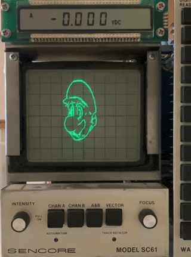

# Vector-Scope
Esp32 based vector based animations for unused oscilloscopes.

# How this works
Animations are converted from SVG files (one frame a layer or file) to arrays of coordinates using a browsers SVG API. For each path we offset our position from the start and record each coord along the way till the end. 

The coords are encoded into C++ header files which can then be flashed to the Esp32 and drawn onto the oscilloscopes via the two DAC's.

# Animations
Created using Blender, Turtletoy, Processing and Inkscape.

# Installation
1. Build using [platform.io](https://platformio.org/).
1. Connect DAC pins 25 & 26 on an ESP32 to probes connections.
1. Sap some power from the scope to power the ESP if you want it to be self contained.